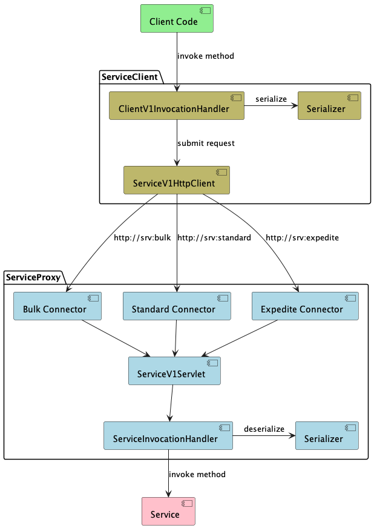
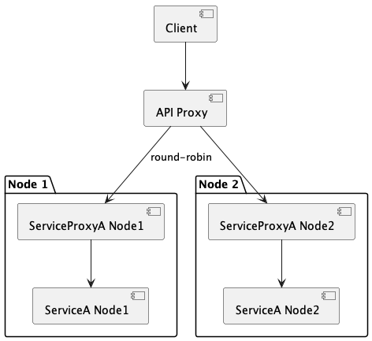
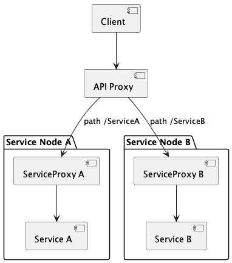

# Service Bus

The Service Bus provides a seamless remote invocation glue for a Java Service API.

The Service Bus is built with the following requirements:
* Proxies a Java interface (the service interface), so the client can invoke the 
service transparently by just invoking the java interface. The service interface
must extend [Service.java](../service-api/src/main/java/no/mnemonic/services/common/api/Service.java)
* Deals with serialization and deserialization of the method arguments, response and exception.
The server configuration defines which classes are allowed as arguments. 
The client configuration defines which classes are allowed as response objects and exceptions.
* Any checked exceptions are transparently thrown by the client. Unchecked exceptions are replaced,
  throwing a runtime exception on the client sidce, but the runtime exception class is not carried to the client.
* Both the server and the client defines a max concurrency (max number of concurrent client requests),
as well as a max number of concurrent server threads.
* On request, the client can specify a priority using the `Service.getServiceContext().setNextRequestPriority(priority)`
method, using priority `bulk`, `standard` or `expedite`.
The server configuration will specify a max concurrency per priority, allowing the
server to control resources for different audiences.
* Any request where the return-type is `ResultSet`, the server will utilize the ResultSet to send
a streaming result, which the client will consume as a stream. This allows both the server
and the client to limit memory consumption when dealing with huge responses.
* The client has a configured max-timeout. To avoid timeouts for ongoing requests, the server side
will send keepalive for ongoing requests, to allow the client to extend the max-timeout
if the request is actually being served.
* The exposed service must provide a session factory, allowing the mechanism
to span a session around each invocation. This allows managing resources that are needed
not just for the initial method invocation, but also during streaming of the response 
(e.g. keeping the database connection open).

The base concepts are represented by the `service-api` package:
* `Service` - base java interface which exposed services must implement
* `ServiceContext` - context interface exposed by the Service Bus to interface with the Service Bus runtime.
* `ServiceSessionFactory` - exposed by the service to open a session
* `ServiceSession` - represents resources needed while invoking the service method, and streaming the result.

## Service Proxy using HTTP

See package `service-proxy`.

The Service Proxy is a more direct implementation of the Service Bus, 
using HTTP between the client and server.

The server-side exposes a lightweight Jetty webserver, which listends to _three ports_,
one port per priority, to allow the client to send and enqueue requests
of different priorities into separate handler queues.
Server-side concurrency is controlled by adjusting the Jetty connector thread pool.



Each method invocation is a HTTP request to the server, 
where the service and method is part of the URI.
Using HTTP means that the client may connect directly to the server, without using a broker:
```
http://my.server/service/v1/<fqdn.Service>/single/<Method>
```

However, to scale the system, the configured client URI may be configured
to point to an API proxy, which in turn may delegate the request
to a set of server nodes.



Since the service is a part of the URI, the API proxy may be used to proxy
many different services, as long as the routing of each service is correct.



## Setting up service proxy server
```
  TestService service = createServiceInstance();
  ServiceInvocationHandler<TestService> invocationHandler = ServiceInvocationHandler.<TestService>builder()
            .setProxiedService(service)
            //serializer to use
            .addSerializer(serializer)
            //ServiceSessionFactory which wraps every invocation
            .setSessionFactory(sessionFactory) 
            .setExecutorService(executorService)
            .build();
  proxy = ServiceProxy.builder()
            .addInvocationHandler(TestService.class, invocationHandler)
            .build();
  //start listening         
  proxy.startComponent();            
```

### Configuring listening ports

By default, the service proxy listens to 3 different ports, one port for each priority.
This can be configured when setting up the service proxy:
```
    proxy = ServiceProxy.builder()
            .addInvocationHandler(TestService.class, invocationHandler)
            .setBulkPort(9001)
            .setStandardPort(9002)
            .setExpeditePort(9003)
            .build();
```

### Configuring thread resources

By default, the service proxy is set up with 5 bulk threads, 5 standard threads
and 5 expedite threads. This can be configured when setting up the service proxy:

```
    proxy = ServiceProxy.builder()
            .addInvocationHandler(TestService.class, invocationHandler)
            .setBulkThreads(5)
            .setStandardThreads(10)
            .setExpediteThreads(10)
            .build();
```

### Adding multiple routes to a single service proxy

A single ServiceProxy can register multiple services, routing them to 
separate invocation handlers.

```
 ServiceInvocationHandler<MyServiceA> invocationHandlerA = ServiceInvocationHandler.<MyServiceA>builder()
            .setProxiedService(myServiceA)
            .build();
 ServiceInvocationHandler<MyServiceB> invocationHandlerB = ServiceInvocationHandler.<MyServiceB>builder()
            .setProxiedService(myServiceB)
            .build();
 proxy = ServiceProxy.builder()
            .addInvocationHandler(MyServiceA.class, invocationHandlerA)
            .addInvocationHandler(MyServiceB.class, invocationHandlerB)
            .build();
```

**Note**: Multiple services using the same service proxy will share
the thread resources per priority.
To set up independent thread resources for each service, you need to set up
separate service proxy for each service, listening to unique ports.

## Setting up the Service Client

To invoke the service proxy, set up 
- the serializer to use (must be supported by the proxy)
- a HTTP service client, configured with the URL and listening ports of the proxy
- the client itself

```
    Serializer serializer = XStreamSerializer.builder()
        .setAllowedClass(TestService.class)
        .setAllowedClass(TestException.class)
        .build();

    ServiceV1HttpClient httpClient = ServiceV1HttpClient.builder()
        .setDebug(true)
        .setBaseURI(HTTP_BASE_URI)
        .setBulkPort(9001)
        .setStandardPort(9002)
        .setExpeditePort(9003)
        .build();

    ServiceClient<TestService> client = ServiceClient.<TestService>builder()
        .setProxyInterface(TestService.class)
        .setV1HttpClient(httpClient)
        .setSerializer(serializer)
        .build();
        
    TestService clientProxy = client.getInstance();
```

The instance returned from the proxy implements the service interface, 
and will proxy every invocation to the service proxy.

## Extending the response

In some use cases, it is required to pass additional data back to the client, than what is part of the response class.
* If the response class is extending the generic `ResultSet` interface, with additional top-level metadata (not content per resultset item)
* If the data to return is a cross-cutting concern (not something to put into every response class)

### Implementing an extended ResultSet interface

* Define your own interface extending `ResultSet`, with additional properties.
* Use the `ResultSetExtention` annotation to attach a `ResultSetExtender` to the response type
* Implement `ResultSetExtender.extract` to extract a set of metadata keys to represent the extended information.
* Implement `ResultSetExtender.extend` to create the extended ResultSet

Example:
```java
  @ResultSetExtention(extender = MyResultSetExtender.class)
  interface MyAnnotatedResultSet<T> extends ResultSet<T> {
    String getToken();
  }

  public class MyResultSetExtender implements ResultSetExtender<MyAnnotatedResultSet> {

    public static final String METADATA_KEY = "token";

    @Override
    public MyAnnotatedResultSet extend(ResultSet rs, Map<String, String> metaData) {
      return MyAnnotatedResultSetImpl.builder()
              .setIterator((Iterator<Object>) rs.iterator())
              .setCount(rs.getCount())
              .setOffset(rs.getOffset())
              .setLimit(rs.getLimit())
              //resolve token from metadata
              .setToken(metaData.get(METADATA_KEY))
              .build();
    }

    @Override
    public Map<String, String> extract(MyAnnotatedResultSet extendedResultSet) {
      return MapUtils.map(MapUtils.pair(METADATA_KEY, extendedResultSet.getToken()));
    }

  }
```

### Implementing use of cross-cutting metadata handlers

This mechanism is useful to carry service-side extra information to the client side, for _many_ endpoints, without having to change all endpoint response structures.
Example is auditing records or other context information which is needed for a generic solution (monitoring, logging, etc).

On the server side:
* Add server-side code to record your metadata
* Add a cross-cutting interceptor to put the metadata into the `ServiceProxyMetaDataContext`

On the client side:
* Register a `ServiceClientMetaDataHandler` to be notified about the metadata from the service

Example:

On the server side; register an invocation handler which writes the metadata, for example in a cross-cutting method `InvocationHandler`:
```java
public class MyServiceInvocationHandler implements InvocationHandler {
  public Object invoke(Object proxy, Method method, Object[] args) throws Throwable {
    
    //register metadata from somewhere
    ServiceProxyMetaDataContext.putAll(MetaDataRegistry.getMetaData());

  }
}
```

On the client side, pick up the metadata when the response is deserialized:
```java

  public class MyMetaDataHandler implements ServiceClientMetaDataHandler {
    public void handle(Method method, Map<String, String> metaData) {
      //do something with the metadata
    }
  }

  TestService service = ServiceClient.<TestService>builder()
        .setProxyInterface(TestService.class)
        .setV1HttpClient(httpClient)
        .setSerializer(serializer)
        .withMetaDataHandler(new MyMetaDataHandler()) //register the metadata handler
        .build()
        .getInstance();
```
